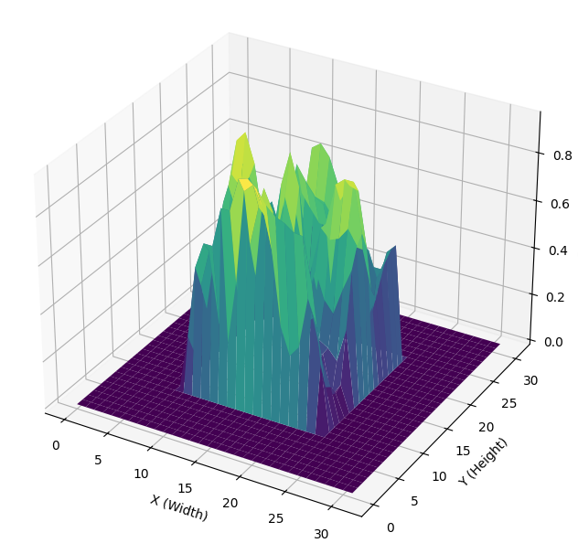

# FNO-MaterialAnalysis-IISc
These works are under **Prof. Akshay Joshi**, **Mechanical Engineering Department**, **IISc Bangalore**, on FNOs (Fourier Neural Networks) in multi-dimensions for material property analysis, in different circumstances. 
Report for the works (download) - [Report]((https://github.com/kaustuv-d/FNO-MaterialAnalysis-IISc/blob/main/iisc_report_2.pdf)) 

## Fourier Neural Operators - based analysis
### Introduction
This repository provides an implementation and application of the Fourier Neural Operators (FNOs), as introduced in the paper "Fourier Neural Operator for Parametric Partial Differential Equations" by Zongyi Li et al. The FNO framework is a groundbreaking approach for solving partial differential equations (PDEs) efficiently and accurately. It leverages the power of Fourier transforms to learn mappings between function spaces, making it highly effective for problems where traditional numerical solvers may struggle with computational efficiency. Refer to the [paper](https://github.com/kaustuv-d/FNO-MaterialAnalysis-IISc/blob/main/fourier_neural_operator_for_pde.pdf)

### Focus
- Implementing the FNO Framework in multiple dimensions
- Applications for Time-Domain-Discretization Independent Predictions : Extending FNOs to predict time-evolving phenomena in a discretization-independent manner and avoiding the limitations of fixed time-step solvers.
- Material Signal Analysis : Using FNOs for predicting and analyzing signals and properties of materials. Insights into material behavior under different conditions using the learned mappings.

### Results and Visualization
#### FNO1D
Function Generation and Prediction based on training on only a certain domain of time arbitrary discretization for both training and prediction.

Training on only 64 and prediction on 2048 time-domain-discretization grid points

#### FNO2D
From 16x16 -> 32x32 (ZeroPadding) --> 1024x 1024 
 
Original rep:   
 
Final rep:    
 
Image Representation: 
 
 
 
As per the paper, testing on the prediction of Navier Stoke Equation in Fluid Mechanics 
 

## Brief Report to be Uploaded...
